System Center Configuration Manager Solution Template Documentation
-------------------------------------------------------------------

Introduction
============

The SCCM solution template provides detailed information of your System Center Configuration Manager including client and server health, malware protection, software updates, and software inventory across your organization.

The template lets you do things like:

-   Compare key System Center Configuration Manager metrics to personalized targets and see how they trend over time

-   Identify trouble spots and get the information you need to understand what needs to be done

The following document provides a walkthrough of installation steps as well as information on cost. For any questions not covered in this document, please contact the team at <PBISolnTemplates@microsoft.com>

Architecture 
-------------

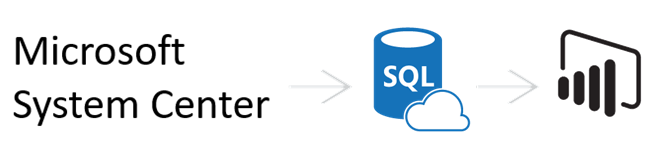

The flow of the SCCM solution template is as follows:

-   Windows task scheduler daily pulls data from your SCCM database

-   The task copies data into Azure SQL (or SQL server)

-   Power BI imports data from Azure SQL (or SQL server) and renders pre-defined reports

System Requirements
===================

-   System Center 2012 Configuration Manager R2 SP1 (5.00.8239.1000) or later. Read access to System Center Configuration Manager database is required.

-   Destination database: Azure SQL database or SQL Server database (SQL Server 2008 R2 SP3 or later).

-   For the machine where the installation is run,

    -   Microsoft .NET Framework 4.5 or later.

    -   PowerShell version 3.0 or later.

    -   For Operating System: Windows Server 2008 R2 SP1, or later. Windows 7 Professional, Enterprise, or later. Note that Windows 10 anniversary update (1607 or later) is not supported at this moment because of a bug in credential guard.

How to Install
==============

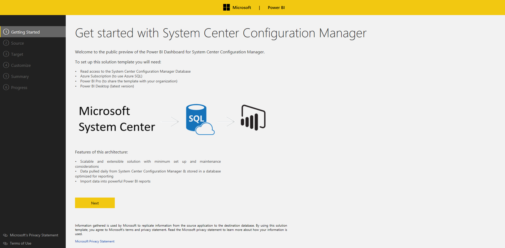

**Step 1: Connect to SCCM database**

Enter a server name for your SCCM database, provide a credential to the server, validate a connection to the server, and choose your SCCM database. Note that the template supports System Center 2012 Configuration Manager R2 SP1 (5.00.8239.1000) or later. The credential used to connect to SCCM will be used to create a scheduled task to pull data from SCCM.

**Step 2: Connect to your destination database**

Enter a server name for your destination database, validate a connection to the server, and choose your database.

-   Option 1 (Azure SQL): SQL user name and password is required.

-   Option 2 (SQL server): either Windows authentication or SQL authentication.

Note that database owner role is required to create tables and execute stored procedures.

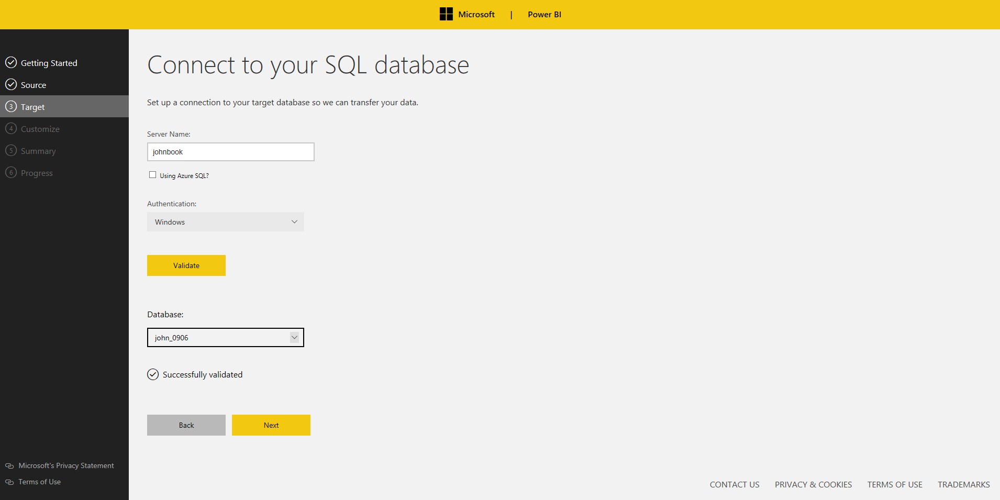

**Step 3: Customize your settings**

Configure the following parameters and click “Validate”.

-   Daily Trigger Time: specify the condition that will trigger the daily task. (at 2:00 AM by default)

-   Data Retention Days: between 1 and 365

-   Endpoint Compliance Target: between 0 and 1

-   Health Evaluation Target: between 0 and 1

Note that the scheduled task will not be triggered if a machine goes to sleep. The task will be restarted as soon as possible when the machine is out of sleep mode.

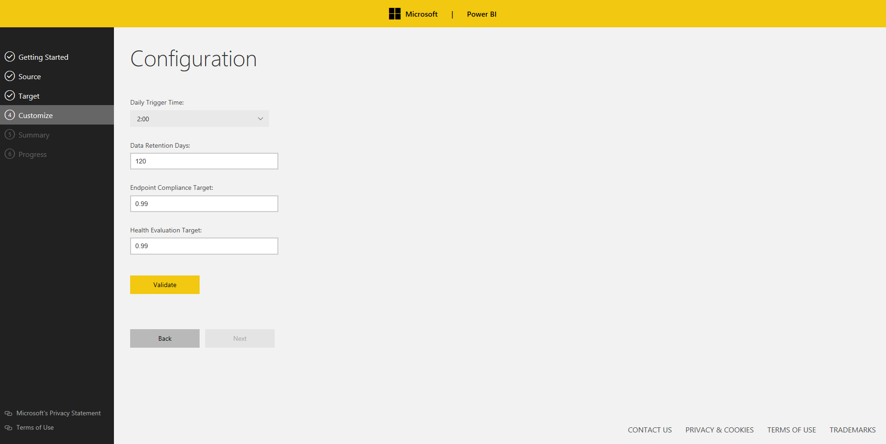

**Step 4: Verify and run **

Verify the information and click “Run”.

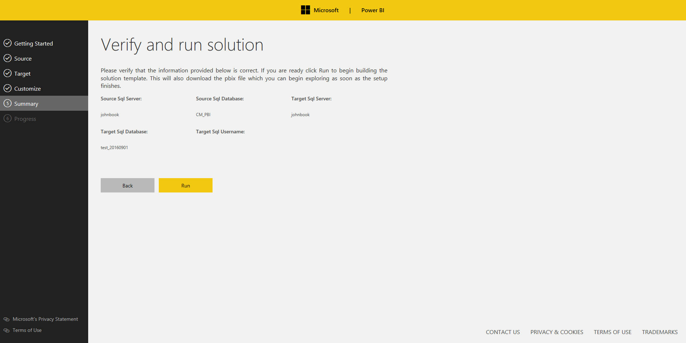

**Step 5: Track your progress **

The setup will create new tables, views, stored procedures in destination database, install required SQL tools if not found, create/run a new task.

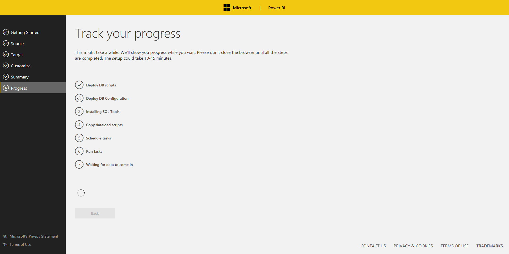

**Step 6: Start pulling data **

We'll show you progress while you wait. Please don't close the browser until all the steps are completed. This might take a while, depending on the size of your SCCM database.

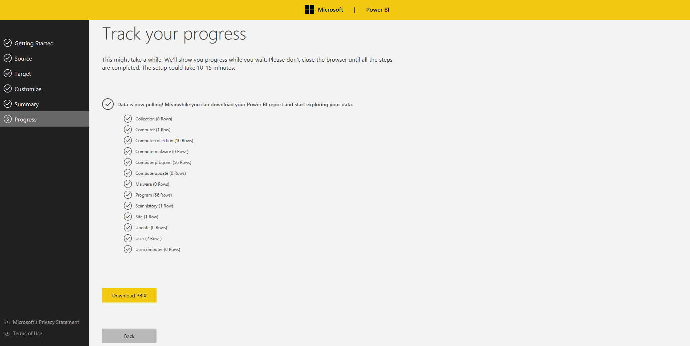

**Step 7: Download PBIX**

Download your Power BI report, open the report, and click “Apply changes” as below. Note that Power BI Desktop is required to open the report (Power BI Desktop can be download from [here](https://powerbi.microsoft.com/en-us/desktop/)).

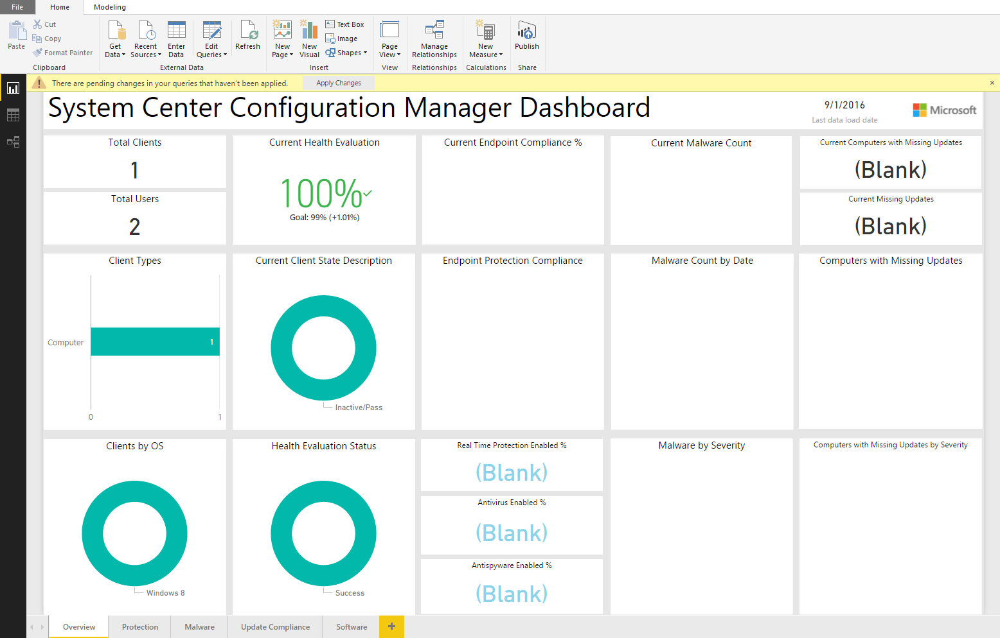

Please click “Refresh” to import data from your destination database and enter your credentials.

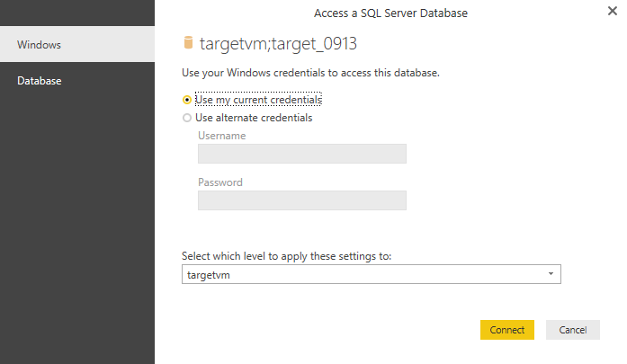

**Step 8: Publish the report to PowerBI.com **

At this point, you should be able to see your SCCM data. If you are interested in publishing the report to [Power BI](https://powerbi.microsoft.com/en-us/) and share it with colleagues, click “Publish” to Power BI.

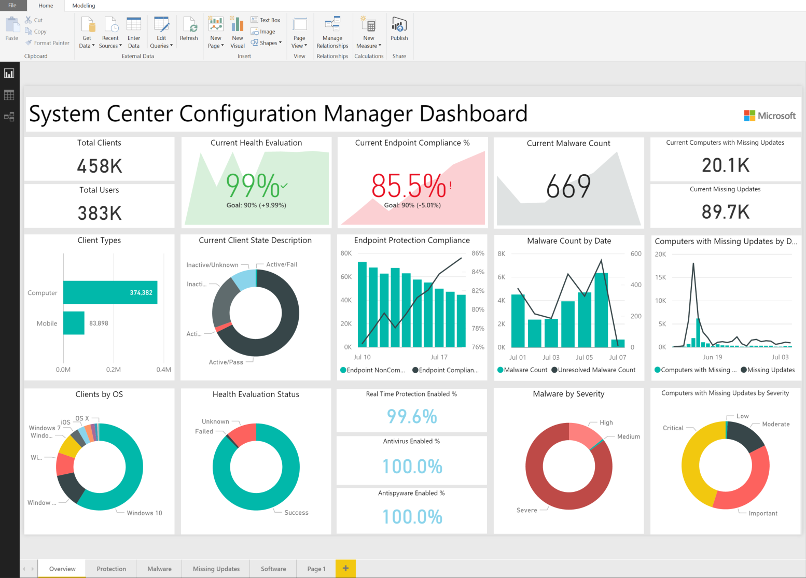

Reports walkthrough
-------------------

### Overview:

The report provides a high level overview of key SCCM metrics to quickly identify machines not up-to-date with software updates, failed mitigations to malware infections to be able to act promptly, failed updates and more.

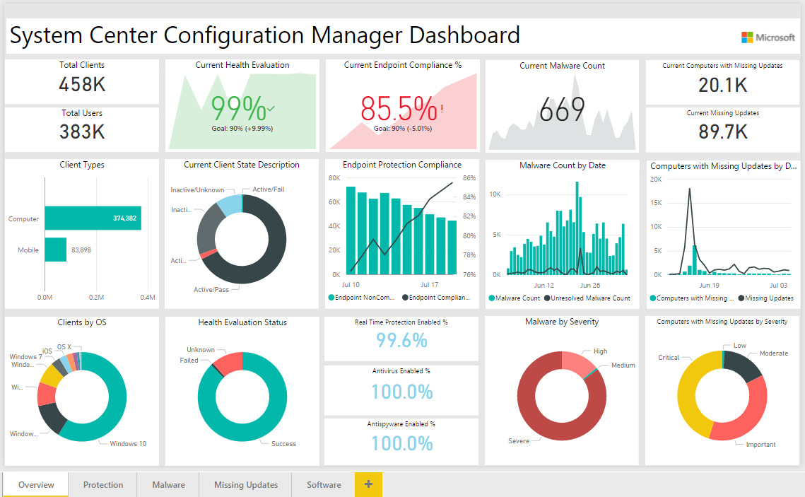

### Protection:

You can track key protection measures for the period you configured during the installation.

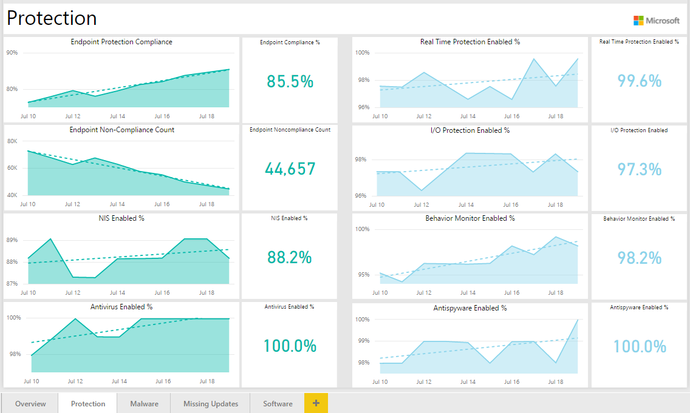

### Malware:

The report shows trend of resolved/unresolved malware count by severity, OS, and remediation type. Malware Category chart (lower-left) shows numbers of resolved malware (color saturation by unresolved malware).

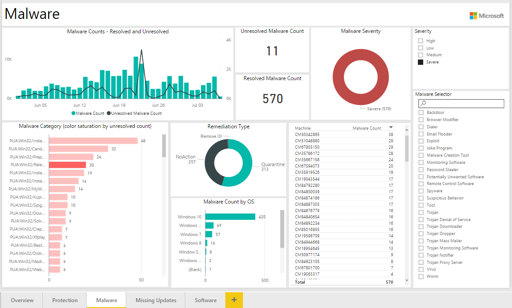

Note that you can enable drill down by selecting the arrow icon in the top right corner of the bar chart. To drill down one field at a time, double-click one of the chart bars. For drill down in details, please click [here](https://powerbi.microsoft.com/en-us/documentation/powerbi-service-drill-down-in-a-visualization/).

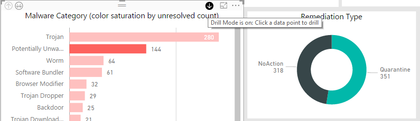

### Update Compliance:

The report lists missing updates by severity and device that can be used to take action.

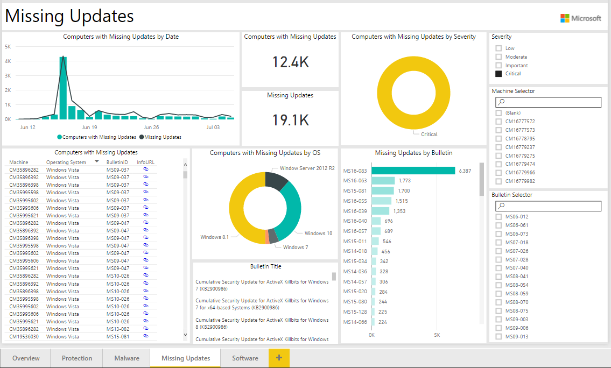

We provide hyperlinks for the missing updates in the table (lower-left). You can click the urls for more information.

### Software Inventory:

The report allows users to select a machine to show installed programs or select a program to show related machines.

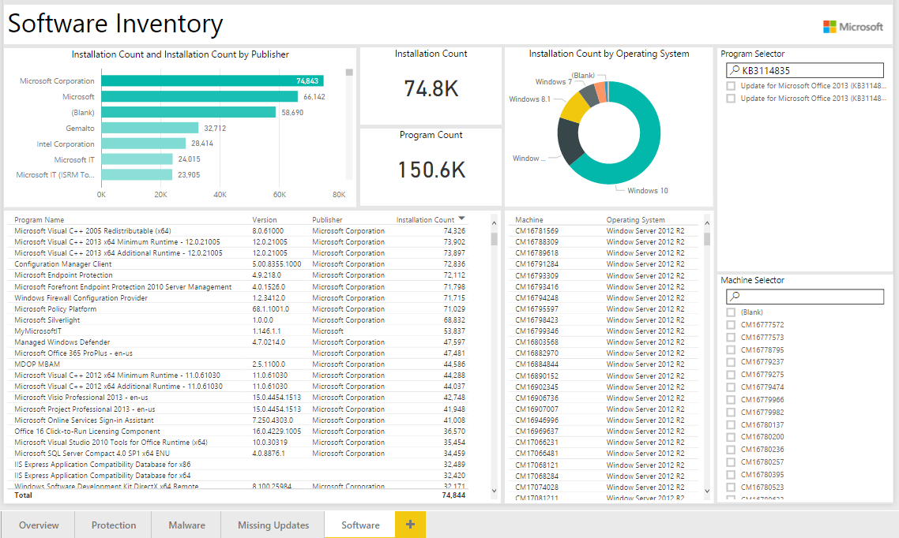

Customizing Template
--------------------

Once you set up the solution template you may want to modify your settings. In order to do this, you will need to go into your SQL database and open the configuration table. It should look something like this:

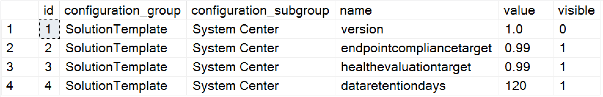

If you want to change the data retention days from 120 days to 60 days, the SQL query will be following:

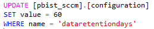

Cost 
=====

Estimated Azure SQL database sizes with number of devices managed by SCCM are following:

| Number of clients | Est. database size (MB) |
|-------------------|-------------------------|
| 500               | 260                     |
| 5,000             | 470                     |
| 50,000            | 2,500                   |
| 500,000           | 23,000                  |

\* data retention is set at 180 days
